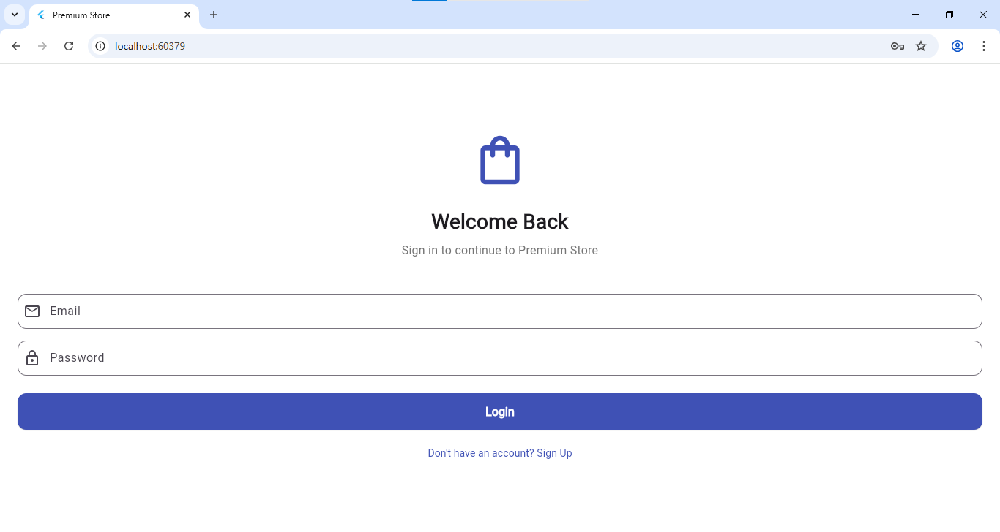
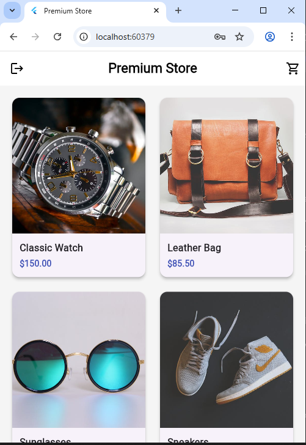
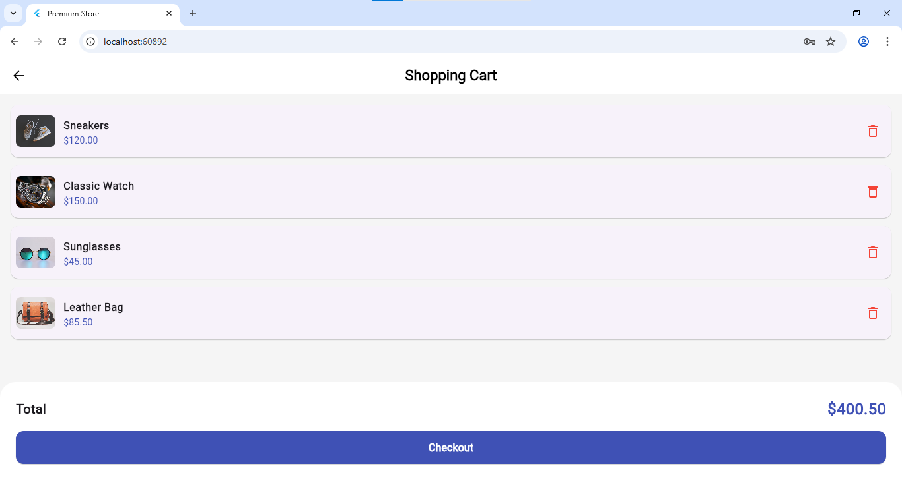
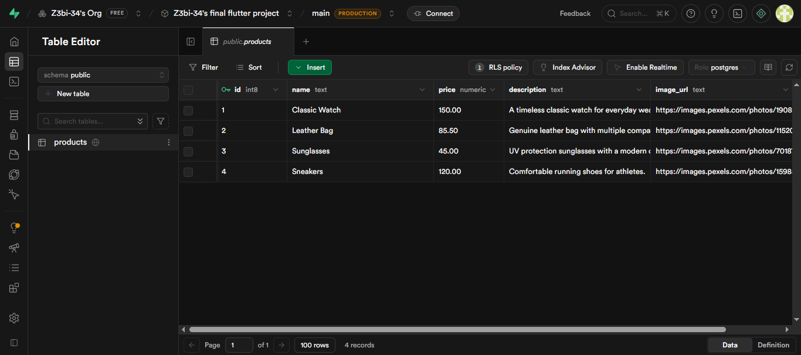

# Premium Store App

## Project Description
Premium Store is a complete e-commerce mobile application built with Flutter and Supabase. It provides users with a seamless shopping experience, featuring secure user authentication, real-time product fetching from a cloud database, and a fully functional shopping cart system. The project demonstrates clean architecture, state management, and modern UI principles.

## Features
* **User Authentication:** Secure Sign-Up and Login functionality using Supabase Auth.
* **Cloud Database:** Products are stored and fetched dynamically from a Supabase PostgreSQL database.
* **State Management:** A custom Cart Manager handles adding, removing, and calculating the total price of items.
* **Clean Architecture:** Code is logically separated into `models`, `screens`, and `widgets` for maintainability.
* **Responsive UI:** A clean, modern grid layout using consistent styling and visual feedback.

## Project Structure
* `lib/models/`: Contains data models (`product.dart`, `cart_manager.dart`).
* `lib/screens/`: Contains the application views (`login_screen.dart`, `signup_screen.dart`, `home_screen.dart`, `product_detail_screen.dart`, `cart_screen.dart`).
* `lib/widgets/`: Contains reusable UI components (`product_card.dart`).

## Screenshots
### App Interfaces

### Database
